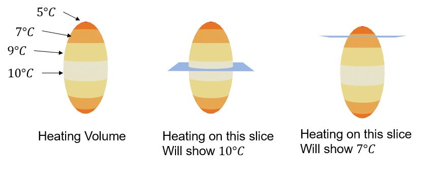

# Main Page

## Table of Contents

- [Main Page](#main-page)
  - [Table of Contents](#table-of-contents)
  - [Getting Started](#getting-started)
  - [Traditional Thermometry](#traditional-thermometry)
  - [Simultaneous Orthogonal Aquisition](#simultaneous-orthogonal-aquisition)
  - [Smearing](#smearing)
  - [Subtracting Baseline For Sparsity](#subtracting-baseline-for-sparsity)
  - [Subtracting  SVD to Reduce Waterflow](#subtracting--svd-to-reduce-waterflow)
  - [ADMM Iterative Step](#admm-iterative-step)
  - [Adding SVD and Baseline for Accurate Pixel Magnitudes](#adding-svd-and-baseline-for-accurate-pixel-magnitudes)
  - [Thermometry](#thermometry)
  - [Code](#code)

## Getting Started

## Traditional Thermometry

MRI Thermometry is the process of measuring the internal temperature of an MR image.  There are multiple thermometry method's that can be used to process MR images into useful temperature maps.  The method used in clinical practice is the [proton resonance frequency method](thermometry.md).

This method compares images to a previous baseline with a known temperature to calculate a change in temperature.

A concern for doctors and surgeons is temperature ambiguity.  Temperature measurements can be ambiguous when the imaging slice is not perfectly centered on the heating focus.  This is demonstrated here:




## Simultaneous Orthogonal Aquisition

## Smearing

## Subtracting Baseline For Sparsity

## Subtracting  SVD to Reduce Waterflow

## ADMM Iterative Step

A more in depth explaination of this step can be found [here](admm.md)
  
## Adding SVD and Baseline for Accurate Pixel Magnitudes

## Thermometry

## Code
```matlab
function [outputVec] = Sa_v(a,v)
    %SA_V Summary of this function goes here
    %   Detailed explanation goes here
    outputVec = zeros(length(v),1);

    for i = 1:length(v)
        real_val = 0;
        imag_val = 0;

        if(real(v(i)) > a)
            real_val = real(v(i)) - a;
        elseif (real(v(i)) < -a) 
            real_val = real(v(i)) + a; 
        else
            real_val = 0;
        end

        if(imag(v(i)) > a)
            imag_val = imag(v(i)) - a;
        elseif (imag(v(i)) < -a) 
            imag_val = imag(v(i)) + a; 
        else
            imag_val = 0;
        end

        outputVec(i) = real_val + j*imag_val;

    end
end
```